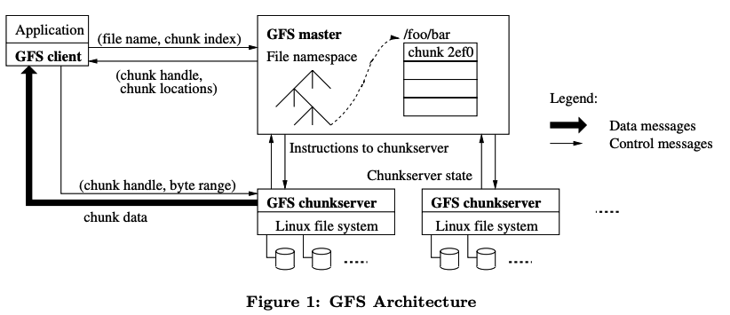
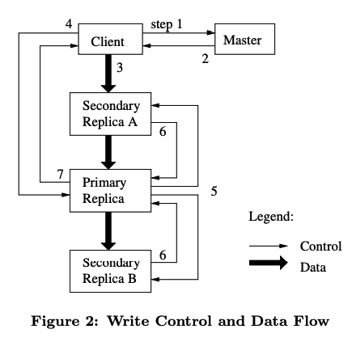

# Lecture 3: GFS

[Video](https://youtu.be/EpIgvowZr00?si=cL3pk87z7LBTkZjM) | [GFS Paper](https://static.googleusercontent.com/media/research.google.com/en//archive/gfs-sosp2003.pdf) and what looks like [notes on the paper](https://pdos.csail.mit.edu/6.824/notes/l-gfs.txt) which is horribly formatted. What is with academics and absolute dogshit design? I get that left-oriented txt is simple, but maybe at least try some markdown?

## Notes on GFS Paper

Written in 2003. Academia had been working on these types of problems for a while, but Google was one of the first to actually put them into action (hiring a bunch of PhDs probably helped that along).

### Intro

* Google needs to process a lot of data. Map Reduce has the processing covered, but we need somewhere to keep the data.
* "Component failures are the norm rather than the exception" everything from bugs to manufacturing errors to people tripping on cords will fuck your stuff up
* Lots of Google's files are massive, multi-GB files are common (probably TB now)
* Most of these files are append-only
* They have the privilege of designing their storage and compute side-by-side, can make some assumptions and loose guarantees

### Design Overview

#### Assumptions

* They have lots of cheap computers that often fail
* Very big files, but not a lot of them
* Two kinds of reads: large streams and small random reads
* Writes are usually long, sequential appends, random writes are rare
* Bandwidth > latency

The takeaway here is that you need to know your situation to design a system that meets your needs. You need to know what the most common things happening, and what are the most important metrics in your use case.

#### Interface

They support the usuals for a file system, along with `snapshot` and `record append`. `Snapshot` does a low-cost copy, while `record append` "allows multiple clients to append data to the same file concurrently while guaranteeing the atomicity of each individual client’s append".

#### Architecture

* Single `master` and multiple `chunkservers` accessed by multiple `clients`
* Files are divided into fixed-sized `chunks`, each of which the `master` gives a unique `chunk handle` to. Each chunk is replicated on multiple `chunkservers` (default 3)
* `master` maintains all metadata (mapping files to chunks, location of chunks) and checks up on its `chunkservers` with `HeartBeat` messages
* No caches: don't make much sense for this use case

#### Single Master

* Single `master` simplifies logic, but makes reliability and performance a concern
* `clients` ask the `master` for directions, then head over to the `chunkservers` they need to talk to for the data

#### Chunk Size

* They pick 64 MB as a pretty large size for each chunk
* The large size of chunks makes things easier on the master for giving out directions and handling mapping
* The drawback is that chunks could end up with lots of data that is often read, creating "hot spots", but this doesn't bother them too much for their use case

#### Metadata (that the Master Handles)

* `chunk` mapping and namespaces are in memory, and written to disk as a log and replicated to other machines for recovery
* `chunk` location info is built on startup (and periodically) by asking each `chunkserver` what they have. This was easier than keeping it all in storage on the `master` node because `chunkservers` would fail, drop, and get added a lot, so we need to actively watch for these events

*I think I get the idea here. I won't dive much more into the specifics, but the important takeaways are to know your situation, and design a system for those strengths. Also I suspect the lecture is just going to go over the important bits anyway.*

## Notes on Lecture

* A lot of thought for distributed systems has gone into storage, and abstracting away the distribution bits.
* Big storage is hard because you want better performance, but that implies a cascade of problems and guarantees you need to build in
  * I want better `performance`
  * So I need to `shard` my work across many servers
  * Many servers means that they'll have lots of `faults`
  * I need `fault tolerance`, `replication` is a good way to handle it
  * Now I risk `inconsistencies` in writing and reading stale data
  * So I need to spend time ensuring I'm consistent, which usually means `low performance`
  * Damnit
* Consistency and replication are big issues; how can we assure that across multiple computers that could be failing or slow at any time that we will get consistent data in and out?
* A bad way to handle replication is to have the client send all requests simultaneously to all replications. This allows latency to jumble up writes between each server, leading to 1 on server 1, and 2 on server 2

*I was right, the lecture details the paper for a good bit. Here's some important bits I missed in the paper.*

* Reads are pretty basic, writes are where things get tricky
* If I want to append to a file (common operation), I need to ask the master where it is, from here we have 2 branches
  * There is no designated primary chunkserver for that chunk
    * The master needs to find the most up to date replica of that data, checking version numbers of each data
    * Pick one replica to be the primary
  * There is a primary
    * Primary picks an offset for itself and replicas to write the data to
    * Replicas send back an ack, if all do, primary sends back "Success"
    * If not all replicas send back an ack, primary sends back "Fail" and you gotta try again

* An issue that can come up is "Split Brain", which can often lead to 2 primaries, usually caused by network partition, where there's network issues between master and primary nodes, but everything else is fine.
